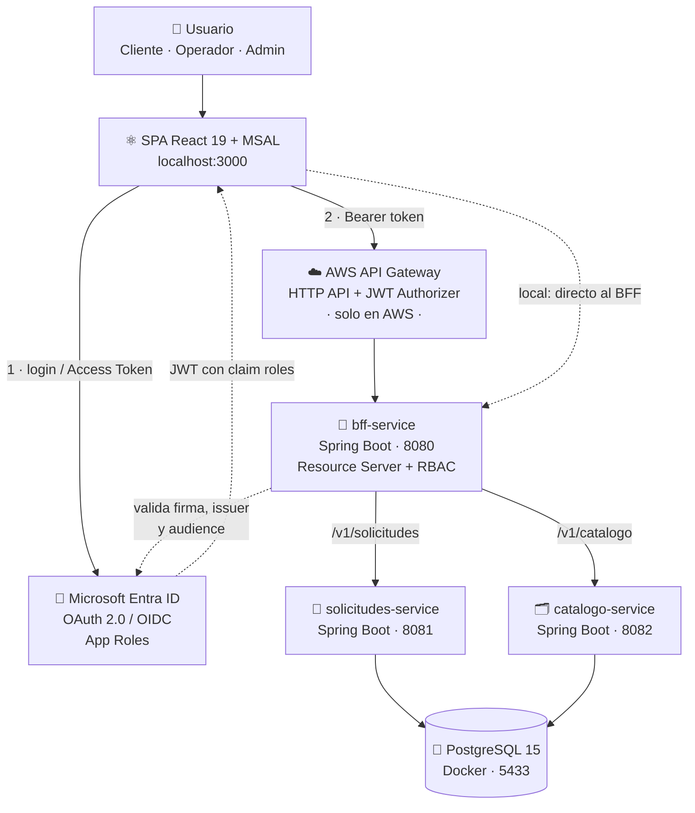

<div align="center">

# 🪑 MesaTech Cloud

### Mesa de ayuda *cloud-native* para soporte técnico — microservicios Spring Boot, SPA en React y autenticación corporativa con Microsoft Entra ID.

[](https://spring.io/projects/spring-boot)
[](https://adoptium.net/)
[](https://react.dev/)
[](https://aws.amazon.com/)
[](https://learn.microsoft.com/entra/identity/)
[](https://www.docker.com/)
[](https://developer.hashicorp.com/terraform)

</div>

---

## 📌 ¿Qué es MesaTech?

**MesaTech** es una mesa de ayuda (*help desk*) donde los usuarios de una organización
levantan solicitudes de soporte técnico, los operadores las gestionan a través de una
máquina de estados y los administradores mantienen el catálogo de categorías.

El sistema está construido con una **arquitectura cloud-native**:

- 🧩 **Microservicios desacoplados** — `solicitudes-service` y `catalogo-service`, cada uno con su propio ciclo de vida y su propio `.jar`.
- 🚪 **Patrón BFF (Backend For Frontend)** — el `bff-service` es la única puerta de entrada de la SPA: agrega, enruta y **valida la seguridad** antes de tocar los microservicios internos.
- 🔐 **Autenticación federada con Microsoft Entra ID** — la SPA obtiene un *Access Token* vía MSAL (OAuth 2.0 / OIDC) y el BFF lo valida como *Resource Server* (issuer + **audience**), autorizando por **App Roles**: `ROLE_CLIENTE`, `ROLE_OPERADOR`, `ROLE_ADMINISTRADOR`.
- 🔁 **Versionado de API** — `/v1` estable y `/v2` opt-in con la categoría ya resuelta, sin romper a los consumidores existentes.
- ☁️ **Despliegue en AWS con Terraform** — EC2 + **API Gateway HTTP API** con *JWT Authorizer* apuntando al mismo tenant de Entra ID.

---

## 🌐 Demo en vivo

La aplicación completa (frontend + backend) está desplegada y funcionando en AWS:

### **https://p1at13oen7.execute-api.us-east-1.amazonaws.com/**

Frontend y backend quedan bajo la misma URL (API Gateway sirve el build de React y reenvía las llamadas de API al `bff-service`), por lo que no hay problemas de CORS en el despliegue. El login usa Microsoft Entra ID — se necesita una cuenta del tenant con un App Role asignado.

---

## 👥 Equipo

- **Kristopher Astudillo**
- **Bianco Martínez**
- **Cesar Flores**

---

## 🏗️ Arquitectura



### Puertos y responsabilidades

| Componente | Puerto local | Rol |
| --- | :---: | --- |
| `frontend` — React + MSAL | `3000` | SPA: login, crear solicitudes, bandeja de operador, catálogo |
| `bff-service` | `8080` | Puerta de entrada: valida el JWT, aplica RBAC y reenvía a los microservicios |
| `solicitudes-service` | `8081` | CRUD de solicitudes + máquina de estados |
| `catalogo-service` | `8082` | CRUD de categorías de soporte |
| `postgres` — Docker | `5433` → `5432` | Persistencia compartida — base `mesatech_db` |

### Máquina de estados de una solicitud

```
CREADA ──▶ ASIGNADA ──▶ EN_PROCESO ──▶ RESUELTA ──▶ CERRADA
   │           │             │
   └───────────┴─────────────┴──────▶ CANCELADA
```

---

## 🧭 Estructura del repositorio

`main` contiene el proyecto **completo y unificado**: backend, frontend, Docker y Terraform. También existen ramas de trabajo (`backend`, `frontend`, `dev`) usadas durante el desarrollo por cada frente del equipo, pero para clonar y levantar el proyecto **basta con `main`**.

```
MesaTech-Cloud/
├── backend/
│   ├── bff-service/          # Puerta de entrada + seguridad Entra ID
│   ├── solicitudes-service/  # Solicitudes + máquina de estados
│   └── catalogo-service/     # Categorías de soporte
├── docker/
│   └── docker-compose.yml    # PostgreSQL 15
├── frontend/                 # SPA React 19 + MSAL
└── terraform/                # EC2 + API Gateway + JWT Authorizer (AWS)
```

---

## ✅ Requisitos previos

| Herramienta | Versión mínima | Verificar con |
| --- | --- | --- |
| ☕ **Java JDK** | 17 (LTS) | `java -version` |
| 🟩 **Node.js** | 18+ — probado en 22 | `node -v` |
| 📦 **npm** | 9+ | `npm -v` |
| 🐳 **Docker Desktop** | 24+, en ejecución | `docker info` |
| 🌿 **Git** | 2.40+ | `git --version` |

> No hace falta instalar Gradle: cada microservicio trae su **Gradle Wrapper** — `gradlew` / `gradlew.bat`.

---

## 🚀 How to Run — local, paso a paso

### 0 · Clonar el repositorio

```bash
git clone https://github.com/KrisAndre-25/MesaTech-Cloud.git
cd MesaTech-Cloud
```

### 1 · Levantar PostgreSQL en Docker 🐘

Con Docker Desktop **en ejecución**:

```bash
cd docker
docker compose up -d
```

Comprobar que el contenedor `mesatech-db` quedó arriba:

```bash
docker ps
# mesatech-db   postgres:15-alpine   Up   0.0.0.0:5433->5432/tcp
```

> [!NOTE]
> El contenedor expone el puerto **5433** en el host — internamente usa el 5432 — para no
> chocar con una instalación local de PostgreSQL. Es el puerto que ya viene configurado
> en los `application.properties`.

### 2 · Compilar y ejecutar los microservicios ☕

Los tres servicios se compilan por separado, desde la raíz del repositorio:

```bash
# En Windows PowerShell usar .\gradlew.bat en vez de ./gradlew

cd backend/solicitudes-service && ./gradlew bootJar
cd ../catalogo-service        && ./gradlew bootJar
cd ../bff-service             && ./gradlew bootJar
```

Luego levantar cada uno **en su propia terminal**. El orden importa: el BFF reenvía a los otros dos.

```bash
# Terminal 1 — Solicitudes  :8081
cd backend/solicitudes-service && java -jar build/libs/solicitudes-service-0.0.1-SNAPSHOT.jar

# Terminal 2 — Catálogo     :8082
cd backend/catalogo-service   && java -jar build/libs/catalogo-service-0.0.1-SNAPSHOT.jar

# Terminal 3 — BFF          :8080
cd backend/bff-service        && java -jar build/libs/bff-service-0.0.1-SNAPSHOT.jar
```

> Alternativa en desarrollo: `./gradlew bootRun` en cada servicio — recompila y ejecuta en un solo paso.

Verificación rápida — el endpoint de versión es público, no pide token:

```bash
curl http://localhost:8080/v2/version
```

### 3 · Ejecutar el frontend ⚛️

En una cuarta terminal:

```bash
cd frontend
npm install
npm start
```

La SPA queda disponible en **http://localhost:3000** 🎉

> [!TIP]
> El login usa Microsoft Entra ID: necesitas una cuenta del tenant con un **App Role**
> asignado — `ROLE_CLIENTE`, `ROLE_OPERADOR` o `ROLE_ADMINISTRADOR`. Sin rol asignado el
> login funciona, pero el BFF responderá `403` en los endpoints protegidos.

### Resumen de URLs

| Servicio | URL |
| --- | --- |
| 🖥️ **Frontend — SPA** | **http://localhost:3000** |
| 🚪 BFF — API | http://localhost:8080 |
| 🎫 Solicitudes | http://localhost:8081 |
| 🗂️ Catálogo | http://localhost:8082 |
| 🐘 PostgreSQL | `localhost:5433`, base `mesatech_db` |

---

## ⚙️ Variables de configuración

### Backend — `src/main/resources/application.properties`

| Propiedad | Servicio | Valor por defecto (local) | Descripción |
| --- | --- | --- | --- |
| `server.port` | los 3 | `8080` / `8081` / `8082` | Puerto HTTP del servicio |
| `spring.datasource.url` | solicitudes, catálogo | `jdbc:postgresql://localhost:5433/mesatech_db` | Cadena de conexión a PostgreSQL |
| `spring.datasource.username` | solicitudes, catálogo | `admin` | Usuario de la base de datos |
| `spring.datasource.password` | solicitudes, catálogo | `adminpassword` | Contraseña de la base ⚠️ solo para entorno local |
| `spring.jpa.hibernate.ddl-auto` | solicitudes, catálogo | `update` | Generación automática del esquema — no usar en producción |
| `services.solicitudes.url` | bff | `http://localhost:8081` | Destino de reenvío del BFF |
| `services.catalogo.url` | bff | `http://localhost:8082` | Destino de reenvío del BFF |
| `spring.security.oauth2.resourceserver.jwt.issuer-uri` | bff | `https://sts.windows.net/<TENANT_ID>/` | Emisor de los JWT de Entra ID |
| `security.oauth2.audience` | bff | `<API_CLIENT_ID>` | *Audience* esperada del token — Application ID de la API |

### Frontend — `frontend/src/authConfig.js`

| Constante | Valor por defecto | Descripción |
| --- | --- | --- |
| `msalConfig.auth.clientId` | `<SPA_CLIENT_ID>` | Application ID del registro de la SPA en Entra ID |
| `msalConfig.auth.authority` | `https://login.microsoftonline.com/<TENANT_ID>` | Autoridad del tenant |
| `msalConfig.auth.redirectUri` | `http://localhost:3000/` | URI de redirección — debe estar registrada en la app |
| `apiRequest.scopes` | `api://<API_CLIENT_ID>/access_as_user` | Scope con el que se pide el *Access Token* del BFF |
| `bffBaseUrl` | `http://localhost:8080` | Base del BFF; en AWS apunta al **API Gateway** |

> [!WARNING]
> Estos valores hoy están **fijos en el código** — `authConfig.js` y `application.properties`.
> Para desplegar en otro entorno hay que editarlos ahí, o externalizarlos a variables de
> entorno: `REACT_APP_*` en Create React App, `SPRING_*` en Spring Boot.

### Infraestructura AWS — `terraform/terraform.tfvars`

| Variable | Valor por defecto | Descripción |
| --- | --- | --- |
| `aws_region` | `us-east-1` | Región de despliegue |
| `instance_type` | `t3.small` | Tipo de instancia EC2 (2GB RAM — necesario para los 3 microservicios + Postgres + frontend a la vez) |
| `allowed_ssh_cidr` | — | CIDR autorizado para SSH — usar `TU_IP/32` |
| `db_name` / `db_user` / `db_password` | `mesatech_db` / `admin` / `adminpassword` | PostgreSQL dentro de la EC2 |
| `entra_tenant_id` | `<TENANT_ID>` | Tenant de Entra ID para el *JWT Authorizer* |
| `entra_api_client_id` | `<API_CLIENT_ID>` | *Audience* validada por API Gateway |
| `cors_allowed_origins` | `["http://localhost:3000"]` | Orígenes permitidos por el BFF |

Detalle completo del despliegue en **[`terraform/README.md`](terraform/README.md)**.

---

## 🔌 Endpoints del BFF

Todos requieren `Authorization: Bearer <access_token>`, salvo `GET /v2/version`.

| Método | Ruta | Rol requerido |
| --- | --- | --- |
| `GET` | `/v1/solicitudes` | `OPERADOR` · `ADMINISTRADOR` |
| `GET` | `/v1/solicitudes/mias` | cualquier autenticado |
| `POST` | `/v1/solicitudes` | cualquier autenticado |
| `PUT` | `/v1/solicitudes/{id}/estado?nuevoEstado=` | `OPERADOR` · `ADMINISTRADOR` |
| `GET` | `/v2/solicitudes` | `OPERADOR` · `ADMINISTRADOR` — incluye nombre y prioridad de la categoría |
| `GET` | `/v2/version` | público |
| `GET` | `/v1/catalogo/categorias` | cualquier autenticado |
| `POST` `PUT` `DELETE` | `/v1/catalogo/categorias[/{id}]` | `ADMINISTRADOR` |

---

## 🧯 Problemas frecuentes

| Síntoma | Causa probable | Solución |
| --- | --- | --- |
| `Connection refused` al iniciar un servicio | El contenedor de PostgreSQL no está arriba | `docker compose up -d` dentro de `docker/` |
| El puerto 5433 está ocupado | Otro contenedor o un PostgreSQL local | `docker ps` y liberarlo, o cambiar el mapeo en `docker-compose.yml` y en `application.properties` |
| `401 Unauthorized` desde el BFF | Token expirado o *audience* incorrecta | Cerrar sesión y volver a entrar en la SPA |
| `403 Forbidden` en `/v1/solicitudes` | La cuenta no tiene el App Role necesario | Asignar el rol en Entra ID → *Enterprise applications* |
| Error de CORS en el navegador | La SPA no corre en `http://localhost:3000` | Usar ese origen, o ajustarlo en `SecurityConfig.java` |

---

<div align="center">

**MesaTech Cloud** · Cloud Native I · Duoc UC

Desarrollado por **Kristopher Astudillo**, **Bianco Martínez** y **Cesar Flores**

</div>
